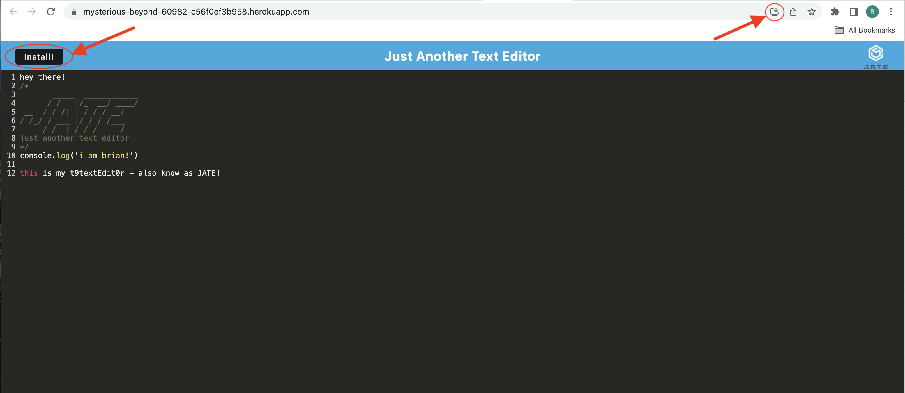

# t9textEdit0r
# Just Another Text Editor

Link To Deployed App:
>[J.A.T.E.](https://mysterious-beyond-60982-c56f0ef3b958.herokuapp.com/)

## Description

In the assignemnt, we've veen tasked with creating a Progressive Web App (PWA). 
A 'PWA' is a text editor, developed to run in the browser, and function both online & offline.
Users may install JATE to their local system, and take notes with JavaScript syntax highlighting.

## Table of Contents

- [Description](#description)
- [Installation](#installation)
- [Usage](#usage)
- [License](#license)
- [Questions](#questions)

## Installation

1. You may begin by cloning this repo into your system.

2. Run `npm install` to install all of the the necessary dependencies.

3. Run `npm run build` to build the dist folder.

4. Run `npm start` to start the app, using the compiled dist folder.

### To Run in Dev-Mode

1. Then clone this repo into your system.

2. Run `npm install` to install all of the necessary dependencies.

3. Run `npm run start:dev` to start the app, in dev mode.

## Usage

This PWA can be used as a text editor, on your local system, allowing an end-user to take notes with JavaScript syntax highlighting.
To install the PWA locally, you may simply click the Install button in the browser's page. Or via the installation icon, located on the right side of the url bar.

## License

This project is under the license of MIT.

## Questions

GitHub account:

>[https://github.com/BrianJohnMaher](https://github.com/BrianJohnMaher)

Reach me through email here to ask any questions about the app!

>Email: [BMaher22@mac.com](mailto:BMaher22@mac.com)